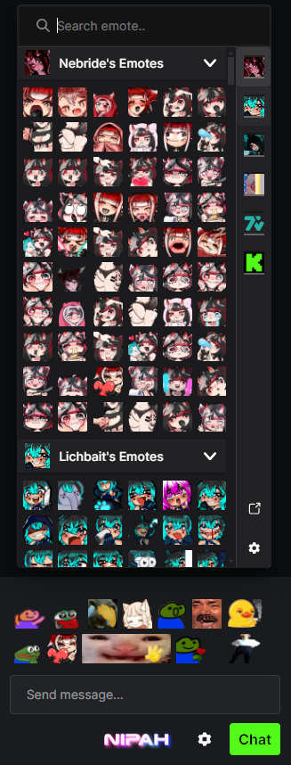

 

  

  <h3 align="center">Better Kick and 7TV Emote Integration for Kick</h3>

  

     
    <a href="#demo-video">View Demo</a>
    ·
    <a href="https://github.com/Xzensi/NipahTV/issues">Report Bug</a>
    ·
    <a href="https://github.com/Xzensi/NipahTV/issues">Request Feature</a>
  

   
  
  
  

 

## About The Project

NipahTV aims to enhance the emote integration experience within Kick chat by providing support for multiple emote providers and improving the user interface. Current options for emote integration in Kick are limited and lack support for multiple emote sources. NipahTV addresses these shortcomings by offering a better interface and compatibility with multiple emote providers.

<b>Please note:</b> This project is under active development and may contain bugs. Your patience and feedback are appreciated as we continue to refine and improve NipahTV.

 

  <video src="https://github.com/Xzensi/NipahTV/assets/14015478/62d07ea5-b629-41a2-990f-47d8ba51c91b" align="center" width="336"></video>

 

## Getting NipahTV

Refer to this [wiki page](/Xzensi/NipahTV/wiki/Installation-instructions) for installation instructions (it'll be simple, I promise).

## Roadmap

-   [x] Support emotes from multiple emote providers (currently supported: Kick, 7TV).
-   [x] Quick emote holder for rapid emote insertion.
-   [x] Fuzzy emote searching that considers your most used emotes.
-   [x] Automatically saves your most used emotes per channel.
-   [x] Insert emotes at caret position.
-   [x] Ctrl+click in quick emote holder to send emotes immediately.
-   [x] Ctrl+spacebar to open emote menu.
-   [x] Chat emotes rendering, so that 7TV extension does not need to be enabled.
-   [x] Emote tab completion (incompatible with 7TV extension).
-   [x] Show emote sets of other subscribed kick channels other than the current one.
-   [x] Settings option for quick emote holder height.

-   BetterTTV provider support
-   Settings option to sort by size or not.
-   Settings option to add settings panel to kick menu to keep UI tidy.
-   Settings option for most used emotes tracking to be global instead of per channel.
-   Settings option to automatically expand quick emote holder on hover.
-   More to come...

## Contributing

If you have a suggestion that would make this better, please fork the repo and create a pull request. You can also simply open an issue with the tag "enhancement".

1. Fork the Project
2. Create your Feature Branch (`git checkout -b feature/AmazingFeature`)
3. Commit your Changes (`git commit -m 'Add some AmazingFeature'`)
4. Push to the Branch (`git push origin feature/AmazingFeature`)
5. Open a Pull Request

(<a href="#readme-top">back to top</a>)

## License

Distributed under the AGPL-3.0-only License. See `LICENSE` for more information.
